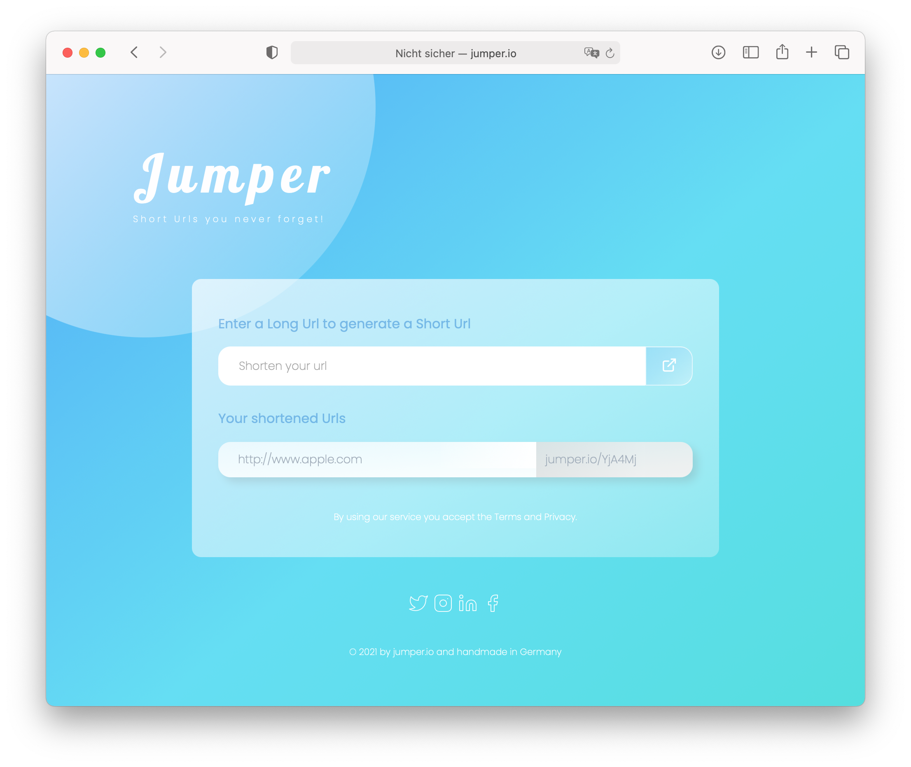

# Shortener-Kubernetes - A Url Shortener

Jumper is a simple url shortener. Url shorteners transform any long URL into a shorter, more readable url. When a user clicks the shortened version, they're automatically forwarded to the original url.

The Jumper Url Shortener is based upon the following technologies:

- Java 21
- Spring Boot 3.2.2
- Vanilla JavaScript
- MongoDB
- Kubernetes

If you have successfully started it, then you can go to [http://localhost](http://localhost:80) and see the following amazing frontend.



## Installation Guide

I assume that you have installed _Docker Desktop_, started it and enabled kubernetes.

### Create docker images

Change to directory `jumper-frontend`.

```bash
cd jumper-frontend
```

Create the docker image for the frontend.

```bash
docker build -t soserdev/jumper-frontend:latest -t soserdev/jumper-frontend:0.1 -f Dockerfile .
```

Change the directory to `jumper-api`.

```bash
cd jumper-api
```

Create the docker image for the api.

```bash
docker build -t soserdev/jumper-api:latest -t soserdev/jumper-api:0.1 -f Dockerfile .
```

There should be two docker images for jumper.

```bash
% docker image ls | grep jumper                                                                  
soserdev/jumper-api                   0.1                                                     41889f012846   About a minute ago   196MB
soserdev/jumper-api                   latest                                                  41889f012846   About a minute ago   196MB
soserdev/jumper-frontend              0.1                                                     2ccbaf883b14   3 minutes ago        22.7MB
soserdev/jumper-frontend              latest                                                  2ccbaf883b14   3 minutes ago        22.7MB
```

### Deploy to Kubernetes

#### Start MongoDB

Now we change to the `kubernetes` directory.

```bash
cd ../kubernetes
```

In order to start MongoDB we first have to create our _persistent volume_ and the corresponding _persistent volume claim_.

```bash
kubectl apply -f storage.yaml
```

There should be one _pvc_ configured and one corresponding _pv_.

```bash
% kubectl get pvc
NAME        STATUS   VOLUME          CAPACITY   ACCESS MODES   STORAGECLASS     AGE
mongo-pvc   Bound    local-storage   10Gi       RWO            mylocalstorage   2m32s

% kubectl get pv 
NAME            CAPACITY   ACCESS MODES   RECLAIM POLICY   STATUS   CLAIM               STORAGECLASS     REASON   AGE
local-storage   10Gi       RWO            Retain           Bound    default/mongo-pvc   mylocalstorage            3m12s
```

Now we can start MongoDB itself.

```bash
kubectl apply -f mongo.yaml
```

#### Start the frontend and the API

Now we start the frontend.

```bash
kubectl apply -f frontend
```

And the api.

```bash
kubectl apply -f api.yaml
```

#### Start the Ingress

Assuming you have Docker for Mac installed, follow the next steps to set up the _Nginx Ingress Controller_ on your local Kubernetes cluster - and take a look at the [Installation Guide](https://kubernetes.github.io/ingress-nginx/deploy/#docker-for-mac) for the actual link.

In order to access the frontend and the backend we have to start the _ingress_.

```bash
kubectl apply -f ingress-deploy.yaml
```

And configure the _ingress_.

```bash
kubectl apply -f ingress.yaml
```

Check if the ingress is running.

```bash
% kubectl get pods --namespace=ingress-nginx
NAME                                        READY   STATUS      RESTARTS   AGE
ingress-nginx-admission-create-knbvf        0/1     Completed   0          57s
ingress-nginx-admission-patch-c2kgp         0/1     Completed   1          57s
ingress-nginx-controller-74469fd44c-vbb4r   1/1     Running     0          57s
```

If the ingress doesn't start properly, you can take a look at the [Installation Guide](https://kubernetes.github.io/ingress-nginx/deploy/#docker-for-mac) for the [actual deployment file](https://raw.githubusercontent.com/kubernetes/ingress-nginx/controller-v1.8.2/deploy/static/provider/cloud/deploy.yaml) and apply that one.


```bash
kubectl apply -f https://raw.githubusercontent.com/kubernetes/ingress-nginx/controller-v1.8.2/deploy/static/provider/cloud/deploy.yaml
```

Everything should be running now.

```bash
% kubectl get all
NAME                              READY   STATUS    RESTARTS   AGE
pod/jumper-api-5846cd4c6b-8bpjx   1/1     Running   0          3m33s
pod/jumper-frontend-b784cd56-v6n4k   1/1     Running   0          1m22s
pod/mongodb-5b4859859c-pxwfm      1/1     Running   0          7m

NAME                     TYPE        CLUSTER-IP       EXTERNAL-IP   PORT(S)     AGE
service/jumper-api       ClusterIP   10.107.131.147   <none>        80/TCP      3m33s
service/jumper-frontend   ClusterIP   10.110.55.249   <none>        80/TCP      1m22s
service/jumper-mongodb   ClusterIP   10.97.105.251    <none>        27017/TCP   7m
service/kubernetes       ClusterIP   10.96.0.1        <none>        443/TCP     7d

NAME                         READY   UP-TO-DATE   AVAILABLE   AGE
deployment.apps/jumper-api   1/1     1            1           3m33s
deployment.apps/jumper-frontend   1/1     1            1           1m22s
deployment.apps/mongodb      1/1     1            1           7m

NAME                                    DESIRED   CURRENT   READY   AGE
replicaset.apps/jumper-api-5846cd4c6b   1         1         1       3m33s
eplicaset.apps/jumper-frontend-b784cd56   1         1         1       1m22
replicaset.apps/mongodb-5b4859859c      1         1         1       7m
```

## Now that everything is fine

### Take a look at the frontend

Now we can take a look at our app. In order to do this, open the browser and go to `http://localhost/` or if configured in your `/etc/hosts` file, just use `http://jumper.io` and create a shortened url.

### Create and get short url using the backend api

It is also possible to create a short url using our backend API.

```bash
% % curl -v -H'Content-Type: application/json' -d'{"url": "http://www.google.com"}' http://localhost/api/shorturl
*   Trying ::1...
* TCP_NODELAY set
* Connected to localhost (::1) port 80 (#0)
> POST /api/shorturl HTTP/1.1
> Host: localhost
> User-Agent: curl/7.64.1
> Accept: */*
> Content-Type: application/json
> Content-Length: 32
> 
* upload completely sent off: 32 out of 32 bytes
< HTTP/1.1 200 
< Date: Fri, 10 Sep 2021 08:49:33 GMT
< Content-Type: application/json
< Transfer-Encoding: chunked
< Connection: keep-alive
< Vary: Origin
< Vary: Access-Control-Request-Method
< Vary: Access-Control-Request-Headers
< 
* Connection #0 to host localhost left intact
{"url":"http://www.google.com","shortUrl":"OWI4OD"}* Closing connection 0
```

In order to to get the original url for a specific short url we can use the following curl command.

```bash
% curl -v http://localhost/api/shorturl/OWI4OD
*   Trying ::1...
* TCP_NODELAY set
* Connected to localhost (::1) port 80 (#0)
> GET /api/shorturl/OWI4OD HTTP/1.1
> Host: localhost
> User-Agent: curl/7.64.1
> Accept: */*
> 
< HTTP/1.1 200 
< Date: Fri, 10 Sep 2021 08:50:56 GMT
< Content-Type: application/json
< Transfer-Encoding: chunked
< Connection: keep-alive
< 
* Connection #0 to host localhost left intact
{"url":"http://www.google.com","shortUrl":"OWI4OD"}* Closing connection 0
```

Invoking `localhost/OWI4OD` will result in a redirect to the original url.

```bash
% curl -v http://localhost/OWI4OD             
*   Trying ::1...
* TCP_NODELAY set
* Connected to localhost (::1) port 80 (#0)
> GET /OWI4OD HTTP/1.1
> Host: localhost
> User-Agent: curl/7.64.1
> Accept: */*
> 
< HTTP/1.1 302 
< Date: Fri, 10 Sep 2021 11:49:35 GMT
< Content-Length: 0
< Connection: keep-alive
< Location: http://www.google.com
< 
* Connection #0 to host localhost left intact
* Closing connection 0
```

### Container shell access and viewing MongoDB database

The `kubectl exec` command allows you to run commands inside a the pods container. The following command line will give you a bash shell inside your mongo container.

```bash
kubectl exec --stdin --tty mongodb-5b4859859c-6l7kn -- /bin/bash
```

Now we can connect to our MongoDB using the `mongo` command.

```bash

I have no name!@mongodb-97c9d6684-h258m:/$ mongo
MongoDB shell version v4.4.8
connecting to: mongodb://127.0.0.1:27017/?compressors=disabled&gssapiServiceName=mongodb
Implicit session: session { "id" : UUID("17551972-8629-4931-a515-97fb91ead8cc") }
MongoDB server version: 4.4.8
---
        Enable MongoDB's free cloud-based monitoring service, which will then receive and display
        metrics about your deployment (disk utilization, CPU, operation statistics, etc).

        The monitoring data will be available on a MongoDB website with a unique URL accessible to you
        and anyone you share the URL with. MongoDB may use this information to make product
        improvements and to suggest MongoDB products and deployment options to you.

        To enable free monitoring, run the following command: db.enableFreeMonitoring()
        To permanently disable this reminder, run the following command: db.disableFreeMonitoring()
---
> 
```

Now we can list all databases using the `show dbs` command.

```bash
> show dbs
admin   0.000GB
config  0.000GB
jumper  0.000GB
local   0.000GB
> use jumper
switched to db jumper
> show collections
urls
> db.urls.find()
{ "_id" : ObjectId("6130c0de8a684423d8e4116d"), "shortUrl" : "YjA4Mj", "originalUrl" : "http://www.apple.com", "_class" : "io.jumper.api.model.ShortUrl" }
{ "_id" : ObjectId("613b1c1d65a8be7b8b2a22c7"), "shortUrl" : "OWI4OD", "originalUrl" : "http://www.google.com", "_class" : "io.jumper.api.model.ShortUrl" }
```
